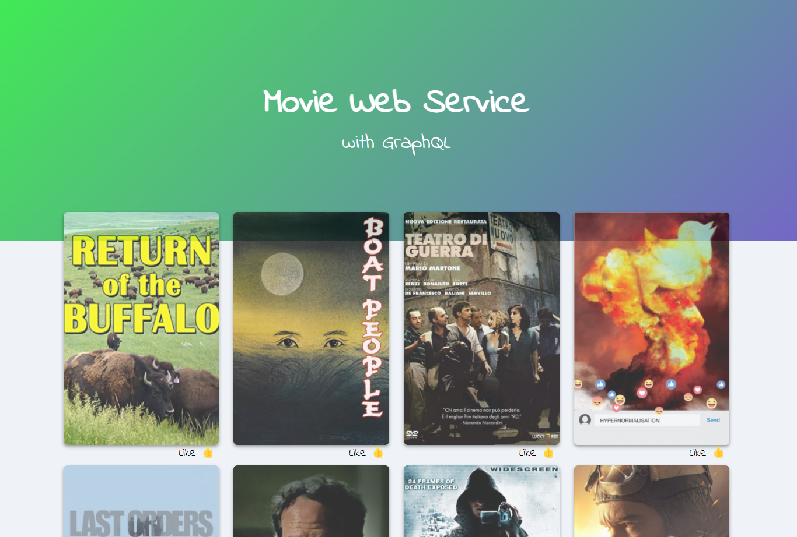
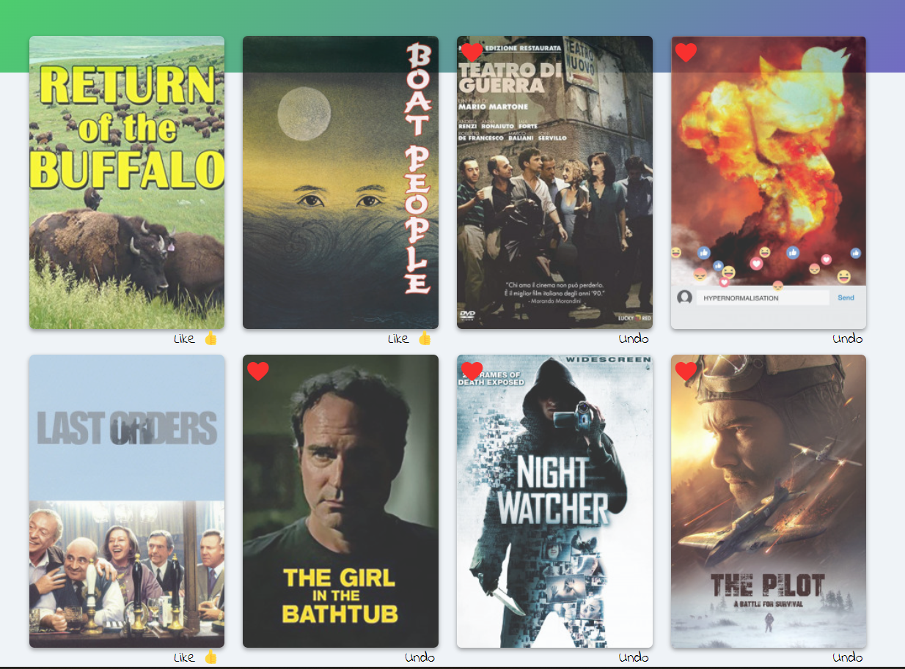
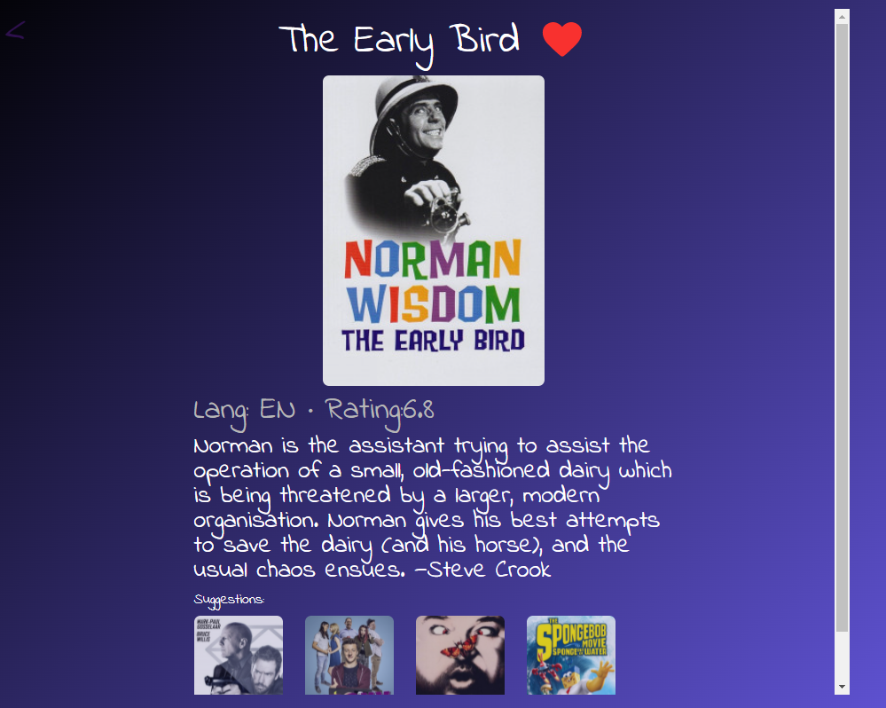

# Movie Web Service

purpose of learning how to connect GraphQL between server and client.

## Summary

Movie Web Service is Web Application using React, Apollo GraphQL that shows users movies, details of movies and suggestions.

> **Demo** [Movie-Web-Service]("https://eavank.github.io/movie-web-service")

## Getting Started

1. Clone this repository.
2. Install dependencies using the `npm install` command
3. Start the web server using the `npm start` command

## Final Product

Home

Like Button

Detail & Suggestion

## Dependencies

- React
- react-router-dom
- @apollo/client
- graphql
- styled-components
- prop-types
